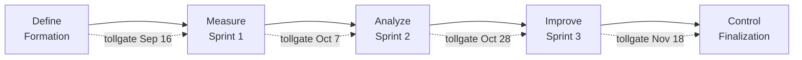

# DMAIC roadmap mapped to the semester

DMAIC (Define, Measure, Analyze, Improve, Control) is the Six Sigma project structure. Each course phase is one DMAIC phase, and each sprint review doubles as the phase tollgate. A tollgate is passed only when every exit criterion below has evidence in the repository.

| DMAIC phase | Course phase | Dates | Tollgate event |
|---|---|---|---|
| Define | Formation and discovery | 2026-09-10 to 2026-09-16 | Topic vote closed, topic brief submitted |
| Measure | Sprint 1: research framing and data foundation | 2026-09-17 to 2026-10-07 | Sprint 1 review (Oct 7) |
| Analyze | Sprint 2: implementation and validation | 2026-10-08 to 2026-10-28 | Sprint 2 review (Oct 28) |
| Improve | Sprint 3: analysis, integration, communication | 2026-10-29 to 2026-11-18 | Sprint 3 review (Nov 18) |
| Control | Finalization and presentation | 2026-11-30 to 2026-12-04 | Final submission |

## Define (Formation, Sep 10 to Sep 16)

**Purpose.** Agree on the problem, the customer, and the scope before anyone writes pipeline code.

**Inputs.** Assignment PDF, MSR 2027 challenge page, GitSkills and SpecMine sample READMEs, each member's proposal issue.

**LSS tools.** SIPOC, CTQ tree, voice of the customer (the rubric), FMEA first pass, team charter.

**Entry criteria.** Repository exists, every member has completed the onboarding issue, at least two proposals filed.

**Exit criteria (tollgate).**
- One research question selected by the documented vote, recorded in `RESEARCH_QUESTION.md` and an ADR in `docs/decisions/`.
- SIPOC and CTQ tree completed for the chosen question.
- Initial backlog: every Sprint 1 rubric deliverable exists as an issue with owner, acceptance criterion, milestone, and estimate.
- FMEA register reviewed; the top five risks have a mitigation owner.
- Team charter signed by all four members.

**Evidence files.** `RESEARCH_QUESTION.md`, `docs/decisions/`, `docs/proposals/`, `docs/lean-six-sigma/SIPOC_AND_CTQ.md`, `docs/lean-six-sigma/FMEA_RISK_REGISTER.md`, `TEAM_CHARTER.md`.

Tollgate checklist:
- [ ] Vote results published and ADR merged
- [ ] SIPOC and CTQ tree reflect the chosen question
- [ ] Sprint 1 issues exist with owners and estimates
- [ ] FMEA top five have owners
- [ ] Charter signed

## Measure (Sprint 1, Sep 17 to Oct 7)

**Purpose.** Establish the data path and a baseline so that later analysis can be trusted. In Six Sigma terms, prove the measurement system before measuring the process.

**Inputs.** Chosen question, approved sample dataset, CTQ tree.

**LSS tools.** Operational definitions (variables, unit of analysis, population), data dictionary, measurement system check (a manually inspected sample agrees with what the extractor reports), first KPI snapshot, value stream map current state.

**Entry criteria.** Define tollgate passed.

**Exit criteria (tollgate).** These restate the Sprint 1 acceptance criteria from the rubric as measurable checks.
- The question is answerable with the selected data: unit of analysis, population, sample, variables, and outcome measures are written in `RESEARCH_QUESTION.md`.
- The data path is documented: `data/README.md` and `DATA_DICTIONARY.md` describe acquisition and every field used.
- The pipeline runs on the approved sample from a clean clone and generates at least one exploratory table or figure into `results/` or `figures/`.
- Measurement check: at least 20 records manually inspected and compared with extractor output, agreement recorded.
- Repository practice: milestones, issues, branch protection or equivalent, and at least one merged PR.
- Primary risks and threats to validity listed in `THREATS_TO_VALIDITY.md` and mirrored in the FMEA.
- Retrospective written with at least one kaizen item.

**Evidence files.** `RESEARCH_QUESTION.md`, `DATA_DICTIONARY.md`, `data/README.md`, `results/`, `figures/`, `docs/sprints/sprint-1/`, `docs/lean-six-sigma/metrics/DASHBOARD.md`.

Tollgate checklist:
- [ ] Operational definitions written
- [ ] Data dictionary covers every field used
- [ ] `make pipeline` or `run_pipeline.sh` succeeds on a fresh clone
- [ ] Measurement check recorded (n, agreement)
- [ ] Branch protection on, one merged reviewed PR
- [ ] Threats to validity drafted
- [ ] Retrospective and kaizen issue filed

## Analyze (Sprint 2, Oct 8 to Oct 28)

**Purpose.** Implement the core method and produce defensible preliminary evidence. Separate what the data shows from what we think it means.

**Inputs.** Working loader, data dictionary, baseline table, Sprint 1 retrospective actions.

**LSS tools.** Hypothesis statements, baseline comparison, validation protocol with agreement statistics, error analysis, control charts on process KPIs, 5 Whys on any signal.

**Entry criteria.** Measure tollgate passed.

**Exit criteria (tollgate).** Restating the Sprint 2 acceptance criteria from the rubric.
- The core implementation runs end to end on the approved sample.
- Automated tests cover the parsing, transformation, matching, or metric functions that the result depends on. CI is green on `main`.
- A validation sample or annotation protocol exists and has been executed with recorded agreement.
- Preliminary results are reproducible figures or tables generated by code, not screenshots.
- At least one PR was reviewed by a member other than the author.
- The report draft contains background, method, implementation, and preliminary results.
- The retrospective records changes to question, method, scope, or interpretation.
- First-time-right rate and cycle time reviewed against targets; signals investigated.

**Evidence files.** `src/`, `tests/`, `results/`, `figures/`, `report/draft.md`, `docs/sprints/sprint-2/`, `docs/lean-six-sigma/metrics/`.

Tollgate checklist:
- [ ] End-to-end run documented in the sprint review
- [ ] Tests present and CI green
- [ ] Validation protocol executed, agreement recorded
- [ ] Figures generated by code
- [ ] Cross-member PR review evidenced
- [ ] Report draft sections present
- [ ] Retrospective records scope and method changes

## Improve (Sprint 3, Oct 29 to Nov 18)

**Purpose.** Strengthen the evidence and the story. Robustness checks, error analysis, and the process improvements from two retrospectives should now be visible in the metrics.

**Inputs.** Preliminary results, validation results, kaizen backlog.

**LSS tools.** Sensitivity analysis, subgroup comparison, error analysis, future-state value stream map, kaizen closure rate, A3 for the biggest process improvement.

**Entry criteria.** Analyze tollgate passed.

**Exit criteria (tollgate).** Restating the Sprint 3 acceptance criteria from the rubric.
- Final or near-final results answer the research question.
- Robustness checks or subgroup comparisons are reported.
- Error analysis with manually inspected examples is written.
- All final figures and tables regenerate from the pipeline.
- Complete draft report with citations, findings separated from interpretation, and a full threats-to-validity section.
- A tagged release exists.
- Demonstration plan and presentation materials exist.
- Retrospective names the single most important process improvement of the semester, backed by metrics.

**Evidence files.** `report/`, `results/`, `figures/`, `THREATS_TO_VALIDITY.md`, GitHub release, `docs/sprints/sprint-3/`, `docs/lean-six-sigma/KAIZEN_BACKLOG.md`.

Tollgate checklist:
- [ ] Results answer the question
- [ ] Robustness and error analysis written
- [ ] `make figures` regenerates everything
- [ ] Draft report complete with citations
- [ ] Release tagged
- [ ] Presentation materials committed
- [ ] Retrospective cites metrics for the top improvement

## Control (Finalization, Nov 30 to Dec 4)

**Purpose.** Lock the result in so that it stays reproducible after the team stops working on it.

**Inputs.** Sprint 3 deliverables, instructor feedback.

**LSS tools.** Control plan, gemba walk (fresh clone reproduction), final KPI snapshot, individual reflections.

**Entry criteria.** Improve tollgate passed.

**Exit criteria (tollgate).**
- A member who did not write the README reproduces the primary results from a fresh clone following only the README.
- Final report, repository release, and presentation submitted.
- AI-use log complete and disclosure statement in the report.
- Every member's contribution and reflection filed in `docs/reflections/`.
- All major artifacts traceable to issues, commits, PRs, or decisions.

**Evidence files.** `README.md`, GitHub release, `report/final.pdf` or `report/final.md`, `ai-use-log.md`, `docs/reflections/`, `docs/lean-six-sigma/CONTROL_PLAN.md`.

Tollgate checklist:
- [ ] Gemba walk passed and recorded in the control plan
- [ ] Final release tagged and linked in README
- [ ] AI-use log and disclosure complete
- [ ] Four reflections filed
- [ ] Traceability spot check (five artifacts) passed

## How a tollgate is run

1. The Scrum Master opens the sprint review with the checklist above pasted into `docs/sprints/<sprint>/review.md`.
2. For each line the owner points at the evidence file or PR. No evidence, no tick.
3. Unticked lines become issues carried into the next sprint with the `rubric` label and `priority:high`.
4. The retrospective that follows uses the KPI dashboard and the unticked lines as its input.
