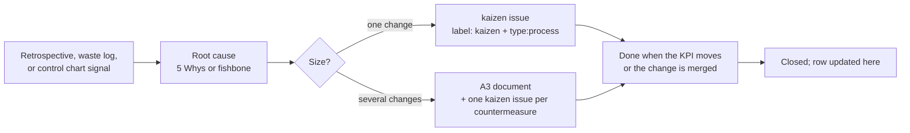

# Kaizen backlog

Kaizen means small, continuous improvement. In this project a kaizen item is any change to how the team works, as opposed to what it builds. Kaizen items are GitHub issues with the `kaizen` label so that they show up on the board and in the metrics (`kaizen_closure_rate`). This file is the human-readable index.

## How items flow

Rules:
1. A kaizen issue names the KPI or waste it targets and the value it should reach.
2. It has an owner, an estimate, and the current sprint milestone.
3. It is closed only when the change is merged and, where a KPI applies, the next weekly snapshot shows the effect, or the team explicitly records that the effect could not be measured.
4. The retrospective reviews every open kaizen item before creating new ones. Open items older than one sprint are either re-prioritized or closed as `not_planned` with a reason.

## Items

| ID | Issue # | Title | Source | KPI or waste targeted | Target | Sprint opened | Owner role | Status |
|---|---|---|---|---|---|---|---|---|
| KZ-01 | #9 | Enable branch protection on `main` (require PR, one review, CI green) | Rubric Sprint 1 deliverable; FMEA R08 | `first_time_right`, reproducibility | Protection active before first Sprint 1 PR | Formation | Scrum Master | Open |
| KZ-02 | #10 | Adopt a 48 h PR review SLA with reviewer rotation | FMEA R12; charter | `pr_first_review_hours` | median <= 48 h | Formation | Scrum Master | Open |
| KZ-03 | #11 | Automate the weekly metrics snapshot (GitHub Actions workflow `LSS metrics`) | LSS plan | All process KPIs | First automated PR merged by Sep 21 | Formation | Developers | Open |
| KZ-04 | | Same-day issue creation for ideas raised in chat | Value stream map | Waiting (idea to issue) | < 1 day | Sprint 1 (planned) | Product Owner | Planned |
| KZ-05 | | Definition of Ready enforced at planning | Value stream map | `rework_ratio` | <= 0.15 | Sprint 1 (planned) | Product Owner | Planned |
| KZ-06 | | Split CI: unit tests on push, full pipeline on PRs to main and nightly | Value stream map | CI wait time | < 5 min on push | Sprint 2 (planned) | Developers | Planned |

Fill in issue numbers when the issues are created with `scripts/bootstrap_github.py` or by hand.

## Closure summary by sprint

| Sprint | Opened | Closed | Closure rate | Most important improvement (from retrospective) |
|---|---|---|---|---|
| Formation | 3 | 0 | 0.00 | |
| Sprint 1 | | | | |
| Sprint 2 | | | | |
| Sprint 3 | | | | |

The Sprint 3 retrospective must name the single most important process improvement of the semester and back it with a before and after KPI value from the dashboard history (`metrics/history.csv`).
