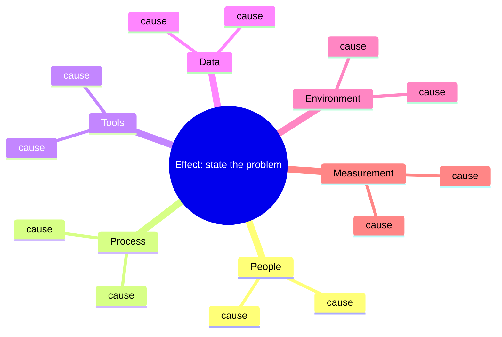

# Root cause analysis templates

Use these when a control chart signals, when a tollgate line is unticked, or when the waste log shows the same thing three times. Copy the template into `docs/sprints/<sprint>/retrospective.md` or into the kaizen issue, fill it in, and link the result.

Rules:
- Analyze the process, not the person. "Why did the PR wait" is a valid question; "why is X slow" is not.
- Stop when the answer is something the team can change this sprint.
- Every analysis ends with at least one countermeasure and an owner, or an explicit "accept the risk".

## Template A: 5 Whys

```
Problem statement (one sentence, with a number):

Why 1:
Why 2:
Why 3:
Why 4:
Why 5:

Root cause (the last "why" that the team controls):
Countermeasure(s):
Owner role:
How we will know it worked (KPI and target):
Kaizen issue #:
```

## Template B: Ishikawa (fishbone)

Categories adapted for this project: People, Process, Tools, Data, Environment, Measurement.



ASCII version if mermaid is unavailable:

```
People ---------\        Process --------\        Tools ---------\
  cause          \         cause          \         cause         \
  cause           >---------------------------------------------------> EFFECT
  cause          /         cause          /         cause         /
Data -----------/        Environment ----/        Measurement --/
```

After filling the bones, circle the two or three causes the team believes matter most and run a 5 Whys on each.

## Filled example: PR #NN sat unreviewed for 5 days

**Problem statement.** PR #NN (loader tests) was opened on a Friday and received its first review on the following Wednesday, 5 days later; the target is 48 hours.

**5 Whys**

| Why | Answer |
|---|---|
| Why 1: Why did the PR wait 5 days? | Nobody was assigned as reviewer, so nobody felt responsible. |
| Why 2: Why was nobody assigned? | The PR template has a "Reviewer" line but it is optional and the author left it blank. |
| Why 3: Why was it left blank? | The author did not know who had time; there is no reviewer rotation. |
| Why 4: Why is there no rotation? | The charter says "another member reviews" but does not say which one. |
| Why 5: Why was that not noticed earlier? | The first two PRs were reviewed quickly because everyone was watching the repository in week one; the metrics dashboard had not run yet. |

**Root cause.** Review responsibility is undefined; it worked by enthusiasm, which does not scale past week one.

**Fishbone summary**

| Category | Causes found |
|---|---|
| People | Author unsure who is free; reviewer duty not explicit |
| Process | Reviewer line optional in template; no SLA; no reminder at check-in |
| Tools | No auto-assignment (CODEOWNERS present but not enforced) |
| Data | Metrics dashboard did not exist yet, so the wait was invisible |
| Environment | PR opened on a Friday before a weekend |
| Measurement | `pr_first_review_hours` not yet reviewed weekly |

**Countermeasures**

| Countermeasure | Owner role | KPI | Target | Kaizen # |
|---|---|---|---|---|
| Reviewer rotation table in `TEAM_CHARTER.md`; author assigns the next person in rotation at PR open | Scrum Master | `pr_first_review_hours` | median <= 48 h | KZ-02 |
| Thursday check-in agenda item: PRs older than 48 h (dashboard section "Open PRs") | Scrum Master | same | same | KZ-02 |
| PR template: reviewer field required (checklist item) | Developers | `first_time_right` unaffected | | KZ-02 |

**How we will know.** Two consecutive weekly snapshots with median first-review time under 48 hours.
