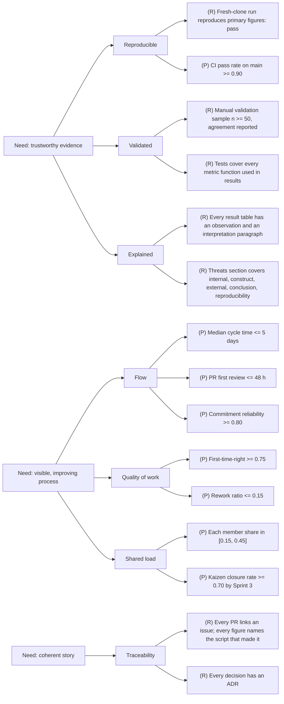

# SIPOC and Critical-to-Quality tree

SIPOC (Suppliers, Inputs, Process, Outputs, Customers) is the one-page definition of the process we are running. The CTQ tree translates what the customers say they want (voice of the customer) into measurable requirements. Both are written for the research pipeline as a whole. Once the topic vote closes, the owner of the Define phase updates the Inputs and Outputs rows for the specific question.

## SIPOC

| Suppliers | Inputs | Process | Outputs | Customers |
|---|---|---|---|---|
| GitSkills authors (Destefanis, Graziotin, Vaccargiu, Ortu) | `agent_skills_sample.db` (SQLite, 277 MB sample; 41 GB full) with tables `artifacts`, `repos`, `artifact_siblings`, `mining_runs` | 1. Acquire | Cleaned analysis tables in `results/` | Instructor (grades against the rubric) |
| SpecMine authors (Agarwal, Singhal, Breaux, Vasilescu) | Parquet files in `data/` of specmine-official plus `specs.jsonl.gz`, `DATA_DICTIONARY.md`, `schema.sql` | 2. Load | Figures in `figures/` regenerated by code | MSR community (readers of the report and repository) |
| GitHub | Repository metadata, commit history (already embedded in both datasets; optional API enrichment) | 3. Extract | Validation sample and agreement statistics | The team (uses the pipeline to answer its own question) |
| Instructor | Assignment PDF, approval of question and sample, sprint feedback | 4. Analyze | Research report (`report/`) | Future students who reuse the repository |
| Team members | Research question, operational definitions, manual annotations, code, reviews | 5. Validate | Tagged release with README, data dictionary, threats to validity | |
| Python ecosystem | pandas, pyarrow, duckdb or sqlite3, matplotlib, pytest | 6. Report | Presentation and demonstration | |

### Process steps in one line each

| Step | What it means for us | Entry | Exit |
|---|---|---|---|
| Acquire | Download the approved sample with `scripts/download_samples.py`; record snapshot version and checksum in `data/README.md` | Question approved | Files present, checksums logged |
| Load | Read SQLite or Parquet into DataFrames with `msr_pipeline.load` | Files present | Row counts match the dataset README |
| Extract | Compute the features the question needs (similarity, staleness, structure, links, and so on) | Loader tested | Feature table written to `results/` |
| Analyze | Statistics, comparisons, models, or classifications | Feature table | Result tables and figures |
| Validate | Manual sample, baseline, tests, agreement measures, error analysis | Results exist | Validation section written |
| Report | Draft, threats to validity, release, presentation | Validation done | Release tagged |

## Voice of the customer

The instructor is the primary customer and the rubric is the voice of the customer. The relevant statements, quoted or paraphrased from the assignment, are:

| VOC statement (source) | What the customer actually needs |
|---|---|
| "Specific, feasible, grounded in the challenge, and connected to an observable software-engineering problem" (Research question criterion) | A question we can answer with the sample in nine weeks |
| "Working, modular, tested pipeline with a clear execution path" (Implementation criterion) | One command runs everything; functions have tests |
| "Results are reproducible, validated, visualized, and accompanied by error analysis" (Evidence criterion) | Figures come from code; a human checked a sample; failures are discussed |
| "Variables and assumptions are explicit; alternative explanations and validity threats are addressed" (Research reasoning criterion) | Operational definitions and a threats section |
| "Issues, branches, commits, pull requests, reviews, milestones, and releases tell a coherent project story" (GitHub practice criterion) | Traceability from idea to artifact |
| "Planning, reviews, retrospectives, and backlog evolution are visible and used to improve the work" (Scrum practice criterion) | Evidence that retros changed something |
| "Report and presentation are clear, accurate, appropriately cautious" (Communication criterion) | Observation separated from interpretation |
| "AI use is disclosed; generated work is verified" (Responsible AI criterion) | Complete `ai-use-log.md` |
| "A new user should be able to install dependencies, run the pipeline, and reproduce the main tables or figures" (Scope rules) | Fresh-clone reproduction passes |

## CTQ tree

Each need becomes a driver, and each driver becomes a measurable CTQ with a target. CTQs marked (P) are process CTQs tracked by the LSS metrics script; CTQs marked (R) are research CTQs checked at tollgates.

### CTQ table

| ID | CTQ | Measure | Target | Where checked |
|---|---|---|---|---|
| C1 | Fresh-clone reproduction | Gemba walk result | Pass | Sprint reviews, Control plan |
| C2 | CI pass rate | `ci_pass_rate` in dashboard | >= 0.90 | Weekly |
| C3 | Validation sample | n and agreement in report | n >= 50 (20 in Sprint 1) | Sprint 2 and 3 tollgates |
| C4 | Test coverage of result functions | Test file per module in `src/` | 100 percent of result-bearing functions | Sprint 2 tollgate |
| C5 | Observation vs interpretation | Report structure | Every result table | Sprint 3 tollgate |
| C6 | Threats coverage | Sections in `THREATS_TO_VALIDITY.md` | Five categories | Sprint 3 tollgate |
| C7 | Cycle time | `cycle_time_days.median` | <= 5 days | Weekly |
| C8 | PR first review | `pr_first_review_hours.median` | <= 48 h | Weekly |
| C9 | Commitment reliability | `commitment_reliability` per sprint | >= 0.80 | Sprint review |
| C10 | First-time-right | `first_time_right` | >= 0.75 | Weekly |
| C11 | Rework ratio | `rework_ratio` | <= 0.15 | Weekly |
| C12 | Contribution share | `contribution.<login>.share_overall` | 0.15 to 0.45 | Weekly |
| C13 | Kaizen closure | `kaizen_closure_rate` | >= 0.70 | Sprint 3 review |
| C14 | PR to issue linkage | PR template checklist | 100 percent | PR review |
| C15 | Decisions recorded | `docs/decisions/` | One ADR per decision | Sprint review |

Targets for process CTQs are stored in `project.yml` under `metrics:` and are the single source of truth for the script. If the team changes a target, change it there and record an ADR.
