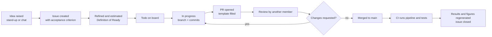
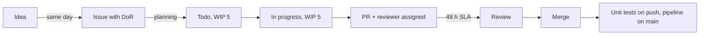

# Value stream map: one backlog item from idea to merged evidence

A value stream map shows every step a work item passes through, how long the step takes when someone is actually working on it (process time), and how long the item waits between steps (wait time). Wait time is where the waste lives. This map is filled in during the Sprint 1 retrospective using real numbers from the metrics dashboard and revisited in Sprint 3.

## Current state

## Step table

Fill the two time columns from the dashboard and from asking the item owner. Use the median over the last five closed issues.

| Step | Process time (PT) | Wait time before this step (WT) | Owner | Data source |
|---|---|---|---|---|
| Issue created | 10 min | 0 to 2 days after the idea | Anyone | Issue `created_at` |
| Refined and estimated | 10 min | until next planning or check-in | PO + team | Issue edit history |
| Todo | 0 | lead time minus cycle time | PO | Dashboard `lead_time_days` and `cycle_time_days` |
| In progress | hours to days | 0 | Owner | Dashboard `cycle_time_days` |
| PR opened | 15 min | 0 | Owner | PR `created_at` |
| Review | 20 to 40 min | `pr_first_review_hours` | Reviewer | Dashboard |
| Rework loop (if any) | varies | review round-trip | Owner | `first_time_right` |
| Merge | 2 min | `pr_merge_hours` minus review time | Reviewer | Dashboard |
| CI and regeneration | 5 to 15 min | 0 | CI | Actions run duration |

**Totals (fill in at the Sprint 1 retrospective).**

| Metric | Value |
|---|---|
| Total process time | |
| Total wait time | |
| Process cycle efficiency = PT / (PT + WT) | |

A process cycle efficiency below 25 percent is normal for a part-time student team; the point is to raise it sprint over sprint, not to hit a factory number.

## Known waste points

| Where | Waste type (DOWNTIME) | Why it happens here |
|---|---|---|
| Idea to issue | Non-utilized talent, Waiting | Ideas are mentioned in chat and forgotten until the next meeting |
| Todo | Inventory | More issues in Todo than the team can finish; WIP limit 5 exists to cap this |
| In progress | Extra processing | Members polish code beyond the acceptance criterion |
| PR to review | Waiting | Reviewers do not see the request; no SLA reminder |
| Review to merge | Motion, Defects | Reviewer asks for tests that the PR template already required |
| CI | Waiting | Full pipeline run on every push instead of only on PRs to `main` |

## Future state (target for Sprint 3)

| Improvement | Expected effect | Kaizen issue |
|---|---|---|
| Issue created within the same day as the idea, using the user-story template | Cut idea-to-issue wait to under 1 day | KZ-04 |
| Definition of Ready enforced at planning: acceptance criterion, estimate, owner | Rework ratio down | KZ-05 |
| Reviewer assigned at PR open with 48 h SLA; Thursday check-in lists PRs older than 48 h | `pr_first_review_hours` median under 48 h | KZ-02 |
| CI runs unit tests on every push, full pipeline only on PRs to `main` and nightly | CI wait under 5 min for most pushes | KZ-06 |
| WIP limit visible on the board (Todo 5, In progress 5) | Lead time minus cycle time shrinks | Already configured |

## How to update this map

1. At the retrospective, paste the median values from `metrics/DASHBOARD.md` into the step table.
2. Update the totals and the efficiency number.
3. Add or close waste points and link them to kaizen issues in [KAIZEN_BACKLOG.md](KAIZEN_BACKLOG.md).
4. Commit the change in the same PR as the retrospective notes.
